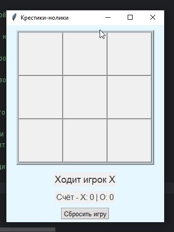

## 🎮 Крестики-нолики (Tic Tac Toe) на Python + Tkinter

Простая реализация игры «Крестики-нолики» с пользовательским интерфейсом. Игра ведётся между двумя игроками до трёх побед одного из них.

### 📁 Структура проекта

```text
tic_tac_toe/
├── main.py         # Точка входа: инициализация интерфейса
├── game_board.py   # Логика игрового поля и действий игрока
├── ui_elements.py  # UI-компоненты: кнопки, лейблы, сброс, выбор символа

🚀 Функции
✅ Игра между двумя игроками

✅ Подсчёт побед для каждого игрока

✅ Игра до трёх побед одного игрока

✅ Обработка ничьей

✅ Кнопка сброса текущей партии

✅ Выбор символа (X или O) перед началом игры

▶️ Запуск
Убедитесь, что установлен Python 3.6 или выше.

🛠 Зависимости
Python (входит в стандартную библиотеку)

Tkinter (входит в стандартную поставку Python)

📸 Скриншот 

